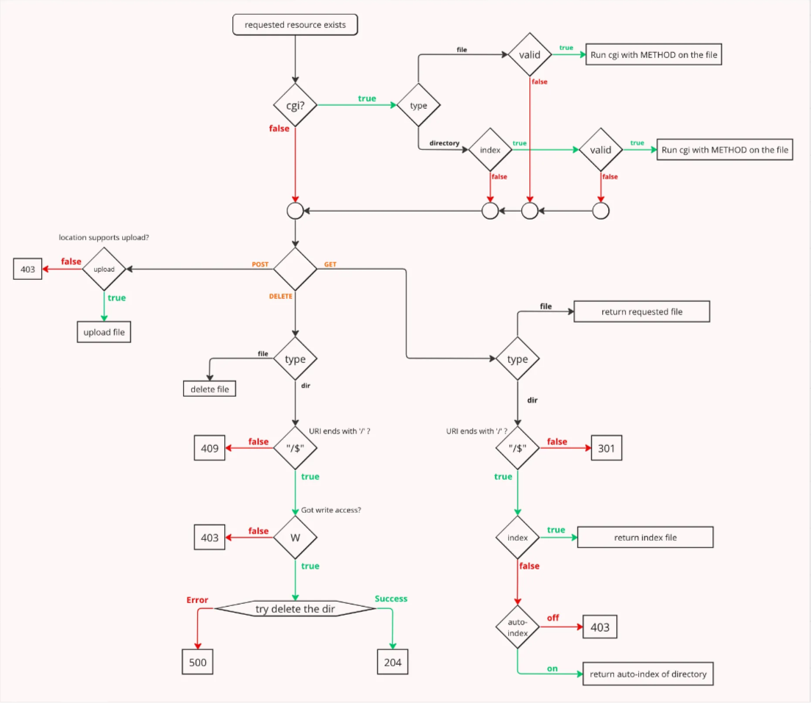

# WEBSERV
42 project - WebServ

see flow-chart.png

HTTP-Version = "HTTP" "/" 1*DIGIT "." 1*DIGIT
ex : HTTP/1.1

url : see url.txt

http message : see message.txt

methods :
	GET and POST : https://www.w3schools.com/tags/ref_httpmethods.asp
	DELETE : https://developer.mozilla.org/fr/docs/Web/HTTP/Methods/DELETE

cgi: see cgi.txt

configuration : see configuration.txt

https://datatracker.ietf.org/doc/html/rfc3986 : URL RFC
http://abcdrfc.free.fr/rfc-vf/pdf/rfc2616.pdf : http/1.1 RFC
https://www.geeksforgeeks.org/fork-system-call/ : fork
https://broux.developpez.com/articles/c/sockets/#:~:text=Les%20sockets%20sont%20des%20flux,protocole%20dit%20«%20non%20connecté%20». : sockets in c
https://developer.mozilla.org/en-US/docs/Web/HTTP/Messages : HTTP messages
https://m4nnb3ll.medium.com/webserv-building-a-non-blocking-web-server-in-c-98-a-42-project-04c7365e4ec7 : general info on project