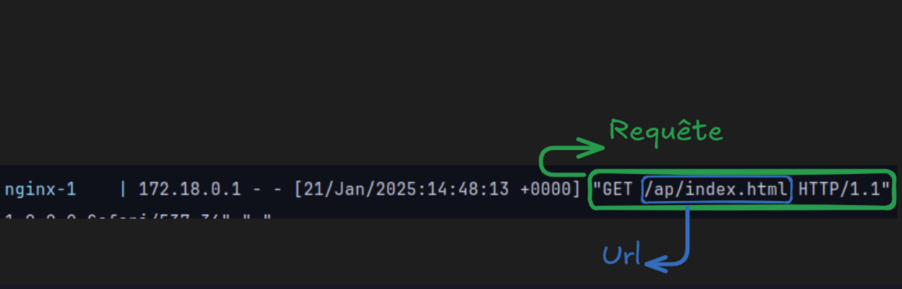
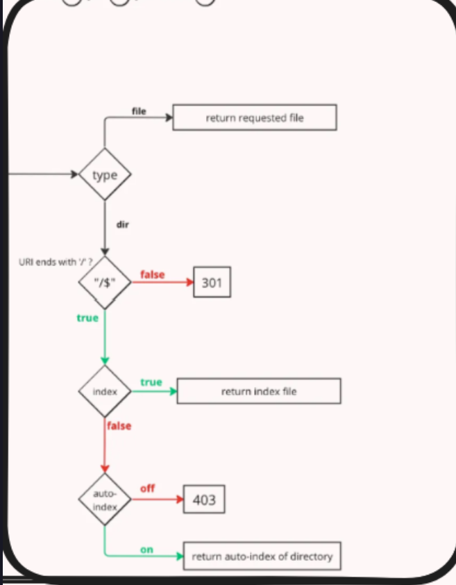
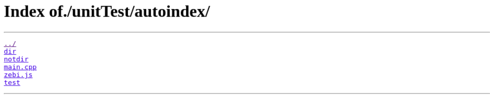

Bienvenue, si tu lit sa, c'est que je dois m'assurer que tu puisse comprendre mon code et tout ce que je fait, alors perdons pas de temps *(si t'arrive pas a comprendre t'es une pute car j'ai tout fait pour que ce soit claire)*

## Contexte
Bien déjà, ou sommes nous ? Le projet est grand et on peut rapidement s'y perdre.
Mon travail se resume a la tache suivante, une fois une requête reçu, je m'occupe de réaliser l'action demander.

Ta pas compris ?, bon je vais expliquer encore plus détailler.

Notre serveur fonctionne de la manière suivante :
- Ecoute sur un port pour recevoir des **requêtes**.
- Verification de la requête (Forme, Contenue, etc ...)
- Application de la requête (Dans le cas d'une requête `GET` le serveur renvoi le fichier demander)

Il existe 9 type de requête mais on s'en fout pour l'instant on s’intéresse aux requêtes de type `GET`.

Ma mission est donc de comprendre quel fichier l'utilisateur veut et renvoyer celui-ci.

>
> Toutefois, comme l’écriture et la lecture de fichier doit être précéder d'un `poll()` pour l'instant je me contente de renvoyer le **path** du fichier.

## La classe
Comment je fait ? Tellement prévisible comme question.
Je passe par une classe, qui a sa construction s'occupera de remplir 2 variable de résultat.
Toujours pas capiche ?, bon regarde.

```cpp
class GetRequest  
{
	private :
		// Some shit for me
	public :
		explicit GetRequest(const std::string& url, ServerConfiguration config);
		// Some shit again and
		int            code;
		std::string    file;
}
```

Regardons le constructeur.
- `url` : correspond a la requête reçu.

- `Config` : correspond a la configuration du server (merci Simon).

Bien maintenant, si tu es intelligent tu te demande pourquoi j'ai un `int` et une `std::string` qui traîne en variable publique.
Ce sont les fameuses variable de résultat dont je te parlais.
Une fois que j'ai fini je met le code dans la variable `code` et le lien vers le fichier dans `file` *(dans le cas de l'auto-index je ne respecte pas trop ca, je le sait)*

Bien maintenant que ma mission et mon arme sont claires, on a plus qu'a passer au code

## Le code
Si a quelconque moment tu ne comprend pourquoi je fait tel actions, réfère toi toujours a ce magnifique flow-chart réaliser par notre ami Benji (c'est faux).


Nous commençons donc dans le fichier `GetRequest.cpp` **ligne 92, au niveau du constructeur** *("nanani, t'aurais pu le mettre en haut ou tout en bas", ta gueule et lit)*

En premier temps j'initialise mes variables, très important sinon sa peut tout casser (hein Simon).

### Check et Fix L’URL

Ensuite on va commencer par étudier l'URL et réaliser 2/3 changement dessus qui vont m'aider.

```cpp
fixUrl(*this, url);
```
*(CTRL + Clique sur la fonction si tu veut regarder le code) (DANS VS CODE PAS ICI idiot).*

Dans un premier temps je regarde si tu n'est pas quelqu'un de vraiment vraiment vraiment très gentil a vouloir sortir du repertoire.
Pourquoi on doit traiter sa ?, si je fait `GET "/../../../../../../../../../../../"` je suis sur de remonter a la racine `/` du serveur, a ce moment, avec un cerveau je peut tout `GET`, et nous on veut pas sa.

Ainsi `checkPath` va renvoyer `true` si l'url reste dans le repertoire, et `false` si on sort, par la suite tu peut voir :

```cpp
if (!isValid)  
    get.setUrl("/");
```

Si on sort, l'url devient `/`, simple, rapide, efficace, pas comme toi.
Ensuite l'url passe par `fixPath` qui a pour mission :
- Retirer `../` de l'url, et aussi le dossier d'avant (on simplifie l'url)
- Retirer les `./` de l'url, pareil on simplifie.

Et voila, on se retrouve avec une URL 100% nettoyer.

---

### Les routes

Bon accroche toi, la on monte en niveau.
Dans la magnifique fichier de configuration on peut retrouver sa :

```nginx
root serveur/

location /tryRoot/ {  
	root /unitTest/srcs/tryRoot/
    index main.html;  
	auto-index on
}  
  
location /unitTest/srcs/ {  
    return 301 /
}  
  
location /unitTest/upload/ {  
    request_method POST DELETE;  
}
```

Je vais pas passer sur tout, mais tout vois que y'a beaucoup de chose a traiter, ma magnifique fonction `addRoot()` va faire le taff.
- On commence par chercher si mon URL est lier a une route. (`location monUrl`)
	- Si non : on retourne la root serveur (`root serveur/`) + URL (si la route serveur est vide sa sera juste URL)
- On garde cette route dans ma classe, flemme de la rechercher tout les 4 matins. `get.setRoot(config.getOneRoutes(it->first));`
- Ensuite on regarde si dans les methods autoriser on trouve `GET`  (`if (!checkAllowMeth(it->second))`)
	- Si non : return de `405` et `Methods Not Allowed`.
- Ensuite on regarde si il y a redirection (`return 301`) | (`if (!it->second.getRedirection().url.empty())`)
	- Si oui : return de `301` et `URl pour la redirection`
- Enfin j'initialise `autoIndex` et redéfini l'url si il y a une `root`.

J'avoue je suis passer assez rapidement ici, mais sa devrait être clair.

---

### Type du fichier

Bien, maintenant qu'on a notre vrais URL et qu'on sait qu'elle ne va plus changer on peu commencer a chercher. Conformément au Flow-Chart, on doit determiner si l'URL pointe vers un `fichier` `dossier` ou vers rien.

```cpp
temp = isDirOrFile(this->_url);  
if (temp == DIRE)  
    directoryCase(*this);  
else if (temp == LS_FILE)  
    setResponse(200, this->_url);  
else  
    setResponse(404, config.getErrorPage(404));
```

C'est le taff de se bloc.
Mais comment `isDirOrFile` sait ?, regarde.

```cpp
if (stat(path.c_str(), &stats) == -1)  
    return (NF); // NF for Not Find 
if (S_ISDIR(stats.st_mode) == DIRE)  
    return (DIRE); // DIRE for DIRECTORY
else  
    return (LS_FILE);
```

La fonction `stat()` fait le travail, car elle stock dans sa structure si c'est un directory ou pas, on récupère cette valeur avec `S_ISDIR()`.

Bien évidement `DIRE` `LS_FILE` `NF` sont des define pour simplifier la comprehension.

Donc, si on reprend le premier bloc de code que j'ai mis :
- Si `DIRE` est retourner : `directoryCase(*this);` on passe a la suite.
- Si `LS_FILE` est retourner : `setResponse(200, this->_url);` All is good
- Si `NF` est retourner : `setResponse(404, config.getErrorPage(404));` on renvoie erreur 404

Et tout est carre, on a fini.
Merde, tu veut savoir comment on géré les dossiers, tu fait chier.

---

### Directory Case

Bien, petite pause, prend ton cafe et on reprend.

Bonne pause ?, bon on est partie.
Si on reprend le Flow-Chart il nous manque les étapes suivantes :
- URL end with `/`
	-  `False` : `301`
- Check `Index`
	- `True` : Return File
- Check `autoIndex`
	- `False` : `403`

On est plus trop loin, alors c'est parti.

#### Check si l'URL fini par `/`

Ce bloc s'en occupe en passant par `checkType()`.
```cpp
get.setUrl(checkType(get.getUrl(), get));  
if (get.code == 301)  
    return;
```
*("Ouieuuh t'aurais pu faire sa en une ligne", ferme la, falais bien configurer la réponse quelques part, pour sa que je passe par une autre fonction, je ne suis pas un barbare comme toi)*

"Oui le code c'est `301` mais file tu l'a mis a quoi ?", ah enfin une bonne question, dans ce cas, on renvoie la meme URL avec simplement un `/` a la fin, ainsi dans `checkType` on constitue la réponse en mettant le code, et l'URL construite, ensuite on return et tout est boucler.

#### Check Index

C'est quoi index ?

Bon, quand tu va sur un site et que tu met juste `addresseDuSite/` tu arrive souvent sur une page type `index.html` *(Si parfois c'est `index.php` je m'en tamponne les couilles reste concentrer)*

Sa c'est configurable dans le magnifique fichier de configuration :
```nginx
index index.html index.php # etc ..., tu peu en mettre autant que tu veut
```

On vérifie dans l'ordre la presence de fichier, si on trouve, renvoie celui la.
Comment on le fait dans mon code, regarde.

```cpp
const std::vector<std::string>  &indexs = get.getIndexVec();
```
On récupère déjà la liste (oui c'est un vector fait pas chier) des pages.
Et ensuite on boucle dessus
```cpp
for (unsigned long i = 0; i < size; i++)  
{  
    if (isDirOrFile(get.getUrl() + indexs[i]) == LS_FILE)  
    {       get.setResponse(200, get.getUrl() + indexs[i]);  
       return (true);  
    }
}
```
On cherche chaque fichier jusqu’à soit :
- Trouver un file existant au nom donner, du coup on set la réponse et bonne soiree
- Ne pas trouver et passer a la suite.

La suite ?

#### L’auto Index
Dernière étape, très simple, de meme que pour l'index, l'auto index se défini dans le fichier de configuration

```nginx
autoindex on # ou off (si pas defini, off par defaut)
```

lors du passage de `addRoute` nous avons initialiser un `bool autoIndex`, si celui-ci est sur `false` c'est la fin, nous ne pouvons rien faire, et conformément au flowchart on renvoie un `403`.

Si il est mis sur `true`, nous avons du travail.
Mais que fait l'auto Index ?
Sa :


Sa liste tout les fichier, via une page HTML.
Tout cela est gérer dans
```cpp
autoIndexCase(get);
```
que l'on va étudier.

Dans un premier temps on va lister tout ce qui se trouve dans le dossier
```cpp
files = ls(get.getUrl());
```
Mais que fait `ls` :
- `opendir` pour ouvrir le dossier
	- Si on a pas réussie a ouvrir le dossier, c'est qu'on a pas les permission donc `403`
- `readdir` pour prendre les info d'un fichier que l'on met dans un vector (on boucle dessus afin de tout prendre)
- `closedir` on est pas des barbare, on ferme la porte derrière nous quand meme (sinon papa valgrind est pas content)

Une fois notre liste obtenue, on construit notre page HTML via
```cpp
get.file = buildPage(files, get.getUrl());
```

Il y a juste quelque protections pour ne pas lire dans quelque chose de vide.
`BuildPage` se contente de mettre le contenu dans une `std::string` qui est mis dans `file`

Et on a fini, on return, le taff est fait.
J’espère que t'a compris car j'ai été clair au debut, et amuse toi bien avec mon code.

---

Le main fonctionne de la manière suivante :
- Si tu lance uniquement en indiquant le fichier de configuration, touts mes test sont lancer
- Si tu rajoute un argument, il sera interpreter comme la requête envoyer.
