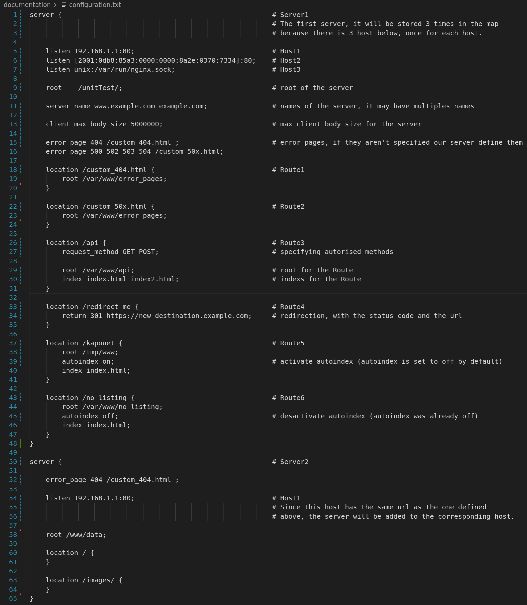
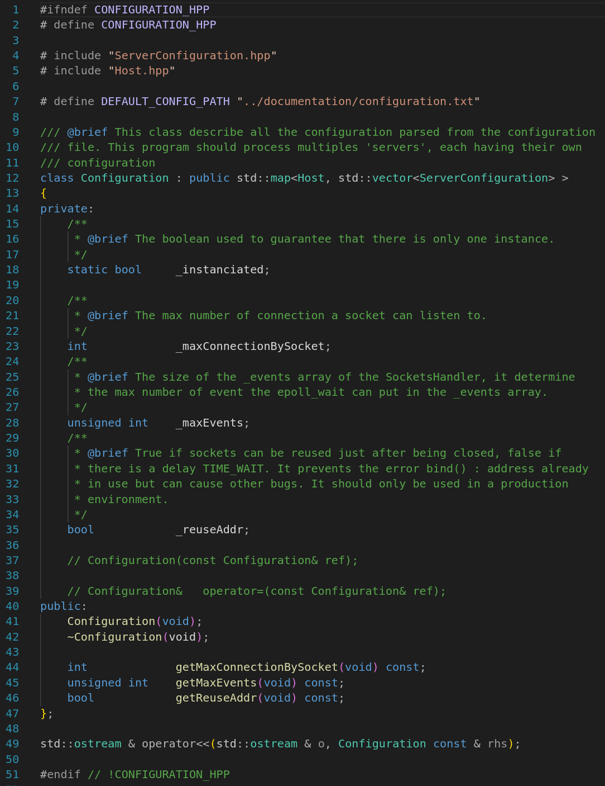
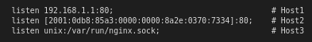
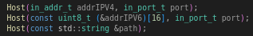
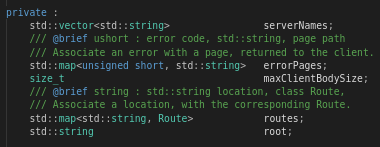
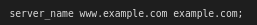
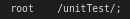
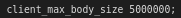
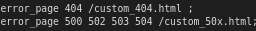

# **PARSING OF CONFIGURATION FILE EXPLAINED**

The configuration file is parsed into a Configuration class.<br>
The Configuration class is a map which contains our hosts.<br>
Each host may have multiples servers.<br>
Our hosts are parsed into an Host class, and our servers into a ServerConfiguration class.<br>
<br>
What it looks like ? <br>

## __Configuration file :__ <br>

 <br>
<br>

## __Configuration class :__ 
<br>

 <br>
<br>

## __Host :__ <br>
Since there is multiples host the server will be copied multiples times and stored <br>
into the corresponding ServerConfiguration vector. <br>
 <br>
 <br>
<br>
An host may have an IP of different type, ipv4, ipv6 or unix_adress. <br>
It has the corresponding constructors. <br>
 <br>
<br>

## __ServerConfiguration class :__ <br>
A server has the following attributes <br>
 <br>
<br> 

__server names :__ <br>
A server may have multiples server names. <br>
That's why we store it into a vector. <br>
```
std::vector<std::string>	serverNames;
```
<br>

 <br>
<br>

__root :__
<br>
The location of our server is stored into : <br>
```
std::string	root;
```
<br>

 <br>
<br>
__max client body size :__
<br>
The maximum size of the html body is stored like this : <br>
```
size_t	maxClientBodySize;
```
<br>

 <br>
<br>

__error pages :__ <br>
We store the errors pages into a map. <br>
We use the error code as the key and the corresponding url as the value. <br>
```
std::map<unsigned short, std::string>	errorPages;
```
<br>

 <br>
If there is multiples errors codes for one url, <br>
every errors codes has the same copied url. <br>
<br> 

If an essential error page is missing it is defined for the user. <br>
```
# define ERROR_403_STR "/custom_403.html"
# define ERROR_403_INT 403
# define ERROR_404_STR "/custom_404.html"
# define ERROR_404_INT 404
# define ERROR_405_STR "/custom_405.html"
# define ERROR_405_INT 405
# define ERROR_500_STR "/custom_500.html"
# define ERROR_500_INT 500
```
<br>
