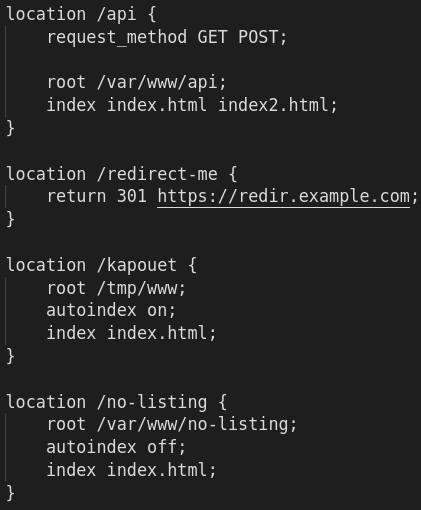
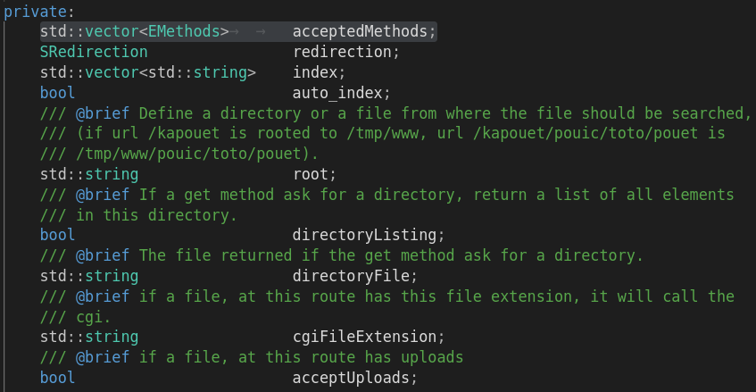

# **PARSING OF CONFIGURATION FILE EXPLAINED**

<span style="color: blue;">
The configuration file is parsed into a Configuration class.<br>
The Configuration class is a map which contains our hosts.<br>
Each host may have multiples servers (vector of servers).<br>
Our hosts are parsed into an Host class, and our servers into a ServerConfiguration class. 
</span>
<br>
<br>
What it looks like ? <br>

## <u>Configuration file :</u> <br>

 <br>
<br>

## <u>Configuration class :</u> 
<br>

 <br>
<br>

## <u>Host :</u> <br>
Since there is multiples host the server will be copied multiples times and stored <br>
into the corresponding ServerConfiguration vector. <br>
 <br>
 <br>
<br>
An host may have an IP of different type, ipv4, ipv6 or unix_adress. <br>
It has the corresponding constructors. <br>

 <br>
<br>

## <u>ServerConfiguration class :</u> <br>
A server has the following attributes <br>
 <br>
<br> 

<span style="color: red;"> <u>server names :</u> </span><br>
A server may have multiples server names. <br>
That's why we store it into a vector. <br>
```
std::vector<std::string>	serverNames;
const std::vector<std::string>	&getServerNames(void) const;
```
<br>

 <br>
<br>

<span style="color: red;"> <u>root :</u> </span>
<br>
The location of our server is stored into : <br>
```
std::string	root;
const std::string	&getRoot(void) const;
```
<br>

 <br>
<br>

<span style="color: red;"> <u>max client body size :</u> </span> <br>
The maximum size of the html body is stored like this : <br>
```
size_t	maxClientBodySize;
const size_t	&getMaxClientBodySize(void) const;
```
<br>

 <br>
<br>

<span style="color: red;"> <u>error pages :</u> </span> <br>
We store the errors pages into a map. <br>
We use the error code as the key and the corresponding url as the value. <br>
```
std::map<unsigned short, std::string>	errorPages;
const std::string	&getErrorPage(unsigned short error) const;
const std::map<unsigned short, std::string>	&getErrorPages(void) const;
```
<br>

 <br>
If there is multiples errors codes keys for one url, <br>
every errors codes has the same copied url. <br>
<br> 

If an essential error page is missing it is defined for the user. <br>
```
# define ERROR_403_STR "/custom_403.html"
# define ERROR_403_INT 403
# define ERROR_404_STR "/custom_404.html"
# define ERROR_404_INT 404
# define ERROR_405_STR "/custom_405.html"
# define ERROR_405_INT 405
# define ERROR_500_STR "/custom_500.html"
# define ERROR_500_INT 500
```
<br>

## <span style="color: red;"> <u>Route :</u> </span> <br>
 <br>
Routes are stored into a map, the key as a string representing the location, <br>
the value is the corresponding Route class. <br>
```
std::map<std::string, Route>	routes;
const std::map<std::string, Route>	&getRoutes(void) const;
const Route	*getOneRoutes(std::string path) const;
const std::string	getLocation(std::string loc) const;
```
<br>

**Route attributes** <br>
 <br>

<span style="color: red;"> <u>Accepted Methods :</u> </span> <br>
If one or multiples request method are specified they are added to a vector. <br>
```
enum EMethods
{
	GET,
	POST,
	DELETE
};

std::vector<EMethods>		acceptedMethods;
```
If none are specified they are all added to accepted methods by deafault. <br>

<span style="color: red;"> <u>Redirection :</u> </span> <br>
If there is a redirection the status code and the url are stored into <br>
the appropriate class, if there isn't these values are empty. <br>
```
SRedirection				redirection;

struct SRedirection
{
public:
	unsigned short	responseStatusCode;
	std::string	url;
};
```

<span style="color: red;"> <u>Index :</u> </span> <br>
If the index keyword is specified, all the following paths will be stored <br>
into a vector. <br>
```
std::vector<std::string>	index;
```

<span style="color: red;"> <u>Auto Index :</u> </span> <br>
If the auto_index keyword is specified it will be set to on or off <br>
depending on the following word. If it isn't specified it is set to  <br>
off by default. <br>
```
bool	auto_index;
```

<span style="color: red;"> <u>root :</u> </span> <br>
The path of the root is stored in a string if specified, otherwise <br>
the string stays empty. <br>
```
std::string	root;
```
